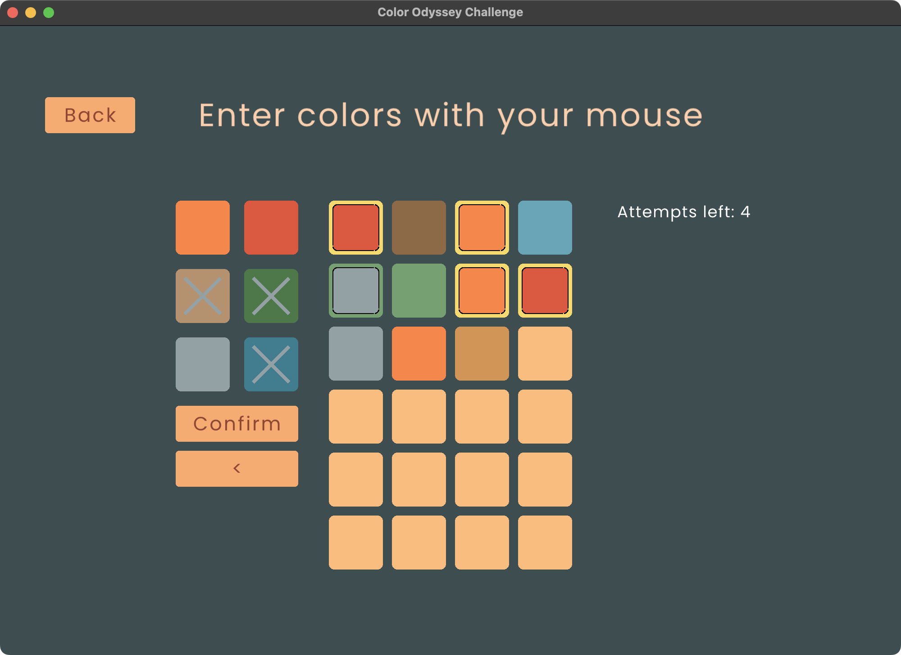

# Color Odyssey Challenge

Color Odyssey Challenge(COC) is a simple game made with [Raylib](https://github.com/raysan5/raylib), specifically [Raylib-cs](https://github.com/chrisdill/raylib-cs).

Game mechanics are based on New Your Times' [Wordle](https://www.nytimes.com/games/wordle/index.html), but with here are words replaced with sequence of colors.

COC also has 2 modes:

1. Random
2. Daily

In daily mode sequence is generated based on the current date and player has only one chance at trying this sequence.

Then, player also can view his stats in both mode to compare with friends 🙂

## Screenshot

Here's a screenshot of the game:



## Building the project

To build the project, you need [.NET](https://dotnet.microsoft.com/en-us/) 8.0+ installed.

Then you can run production build for your system like so:

```sh
dotnet publish -c Release
```

And run it from shell like so:

```sh
./bin/Release/[Dotnet Version]/[Your Platform]/publish/FinalProject
```

> Replace "Dotnet Version" with your dotnet version like "net8.0" and "Your Platform" with your target platform like "osx-arm64".

Additionally, you can simply run it in the debug mode:

```sh
dotnet run
```
